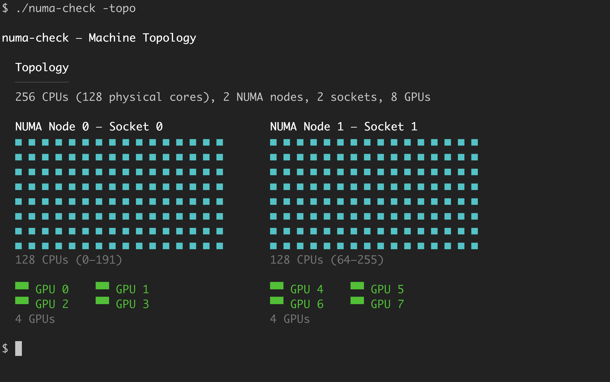
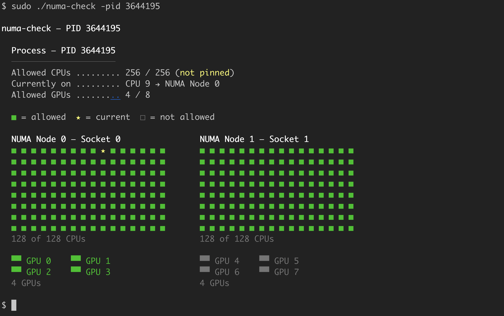
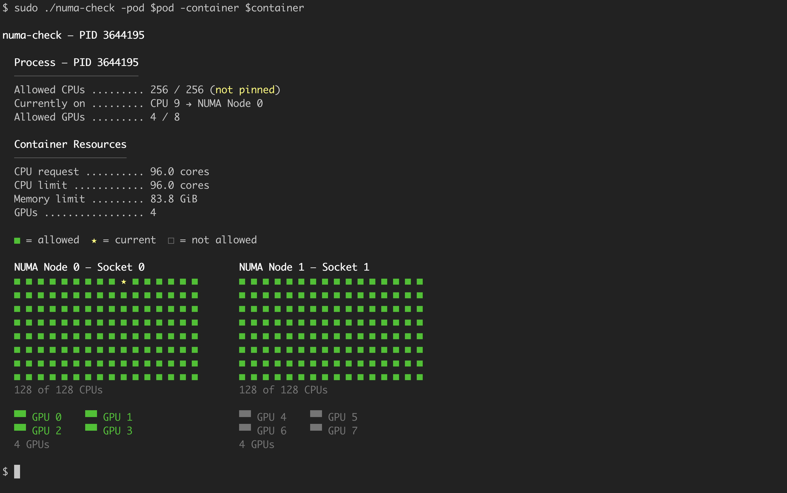

# numa-check

## Why

On multi-socket servers, a CPU accessing memory on a remote NUMA node pays a steep latency penalty. Kubernetes can silently scatter a container's CPUs across NUMA nodes, or place GPUs on a different node than the CPUs they serve. This destroys performance for latency-sensitive and GPU workloads, and nothing in `kubectl` will tell you it's happening.

## What

`numa-check` is a single-binary Linux CLI that reads sysfs and procfs to show you exactly where a process (or container) is placed in the machine's NUMA topology. It reports CPU affinity, pinning status, physical core layout, NUMA node distribution, and GPU-to-NUMA locality -- all rendered as a visual grid so you can spot misplacement at a glance.

## Install

```
GOOS=linux go build -o numa-check .
```

Copy the binary to your target node. No external dependencies for core analysis -- it reads `/sys` and `/proc` directly.

## Usage

**See the machine topology** (no PID needed):

```
numa-check -topo
```



**Check a process by PID** -- the grid shows which CPUs are allowed, which CPU is currently running, and which are unavailable:

```
numa-check -pid <PID>
```



**Check a Kubernetes container** (requires `crictl` on the node) -- also shows container resource requests/limits:

```
numa-check -pod <pod> -container <container>
```



**JSON output** for scripting and automation:

```
$ numa-check -topo -json
$ numa-check -pid 4521 -json
$ numa-check -pod my-pod -container my-container -json -numastat
```

The `-json` flag replaces the visual grid with machine-readable JSON. Works with both `-topo` and process analysis modes. When combined with `-numastat`, the numastat output is included in the JSON. Container resources are included automatically when using `-pod`/`-container`.

**Include numastat memory stats:**

```
$ numa-check -pid 4521 -numastat
```

## Requirements

- Linux with `/proc` and `/sys`
- Optional: `nvidia-smi` (GPU detection), `crictl` (container PID lookup), `numastat` (memory stats)
