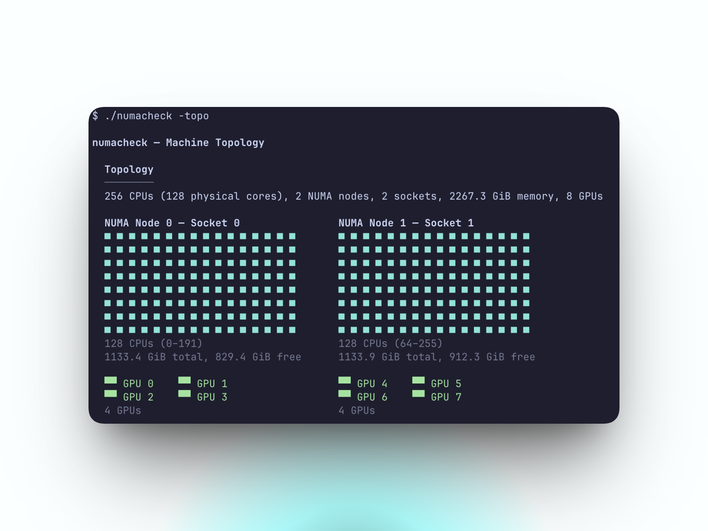
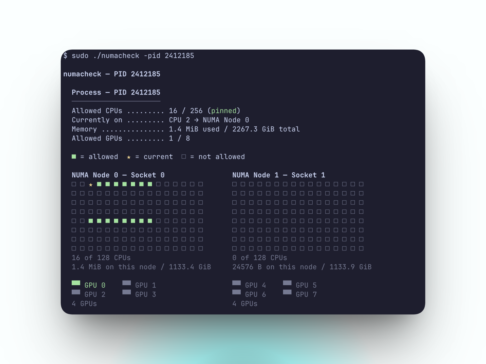
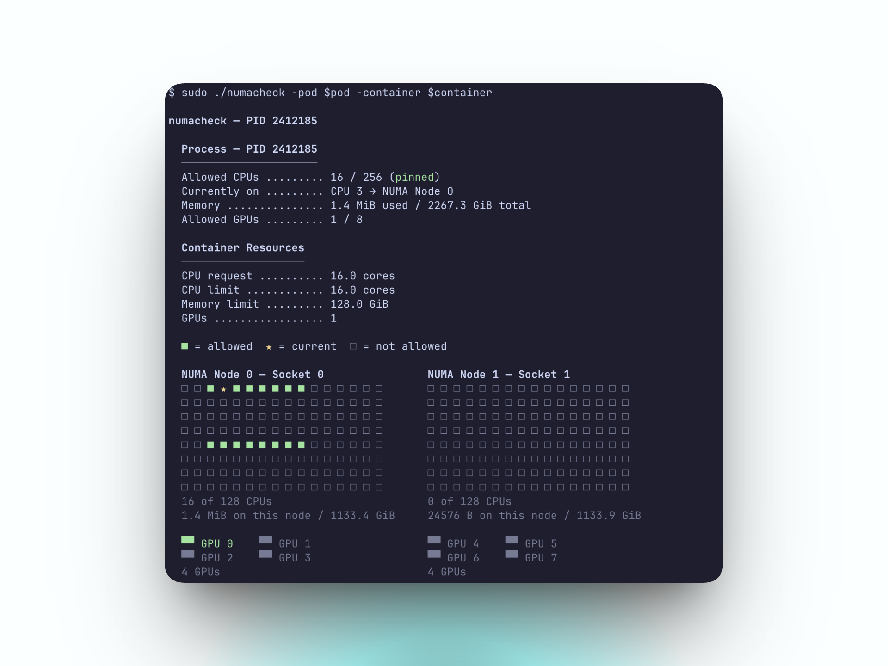

# numacheck

## Why

On multi-socket servers, a CPU accessing memory on a remote NUMA node pays a steep latency penalty. Kubernetes can silently scatter a container's CPUs across NUMA nodes, or place GPUs on a different node than the CPUs they serve. This destroys performance for latency-sensitive and GPU workloads, and nothing in `kubectl` will tell you it's happening.

## What

`numacheck` is a single-binary Linux CLI that reads sysfs and procfs to show you exactly where a process (or container) is placed in the machine's NUMA topology. It reports CPU affinity, pinning status, physical core layout, NUMA node distribution, and GPU-to-NUMA locality -- all rendered as a visual grid so you can spot misplacement at a glance.

## Install

```
GOOS=linux go build -o numacheck .
```

Copy the binary to your target node. No external dependencies for core analysis -- it reads `/sys` and `/proc` directly.

## Usage

**See the machine topology** (no PID needed):

```
numacheck -topo
```



**Check a process by PID** -- the grid shows which CPUs are allowed, which CPU is currently running, and which are unavailable:

```
numacheck -pid <PID>
```



**Check a Kubernetes container** (requires `crictl` on the node) -- also shows container resource requests/limits:

```
numacheck -pod <pod> -container <container>
```



**JSON output** for scripting and automation:

```
$ numacheck -topo -json
$ numacheck -pid 4521 -json
$ numacheck -pod my-pod -container my-container -json
```

The `-json` flag emits a versioned, k8s-style envelope (`apiVersion: numacheck/v1`) instead of the visual grid. Two kinds: `MachineTopology` for `-topo`, and `ProcessReport` for `-pid` / `-pod` + `-container`. Both carry an envelope (`apiVersion`, `kind`, `metadata`) and a `machine` block; `ProcessReport` adds a `process` block.

`metadata` carries `timestamp`, `host`, `numacheckVersion`, plus `pid` / `pod` / `container` when applicable.

`machine` captures:
- `cpu` — total CPUs, physical cores, sockets
- `memory.totalBytes` — total system memory
- `numaNodes[]` — per-node `id`, `socketId`, `cpus`, `memory.{totalBytes, freeBytes}`
- `gpus[]` — per-GPU `index`, `uuid`, `pciId`, `numaNode` (locality)
- `cpuManager` (with `-cpumanager`) — kubelet policy, default CPU set, per-pod entries, and per-NUMA-node exclusive/remaining/total CPU counts

`process` (ProcessReport only) captures:
- `currentCpu`, `currentNumaNode` — where the process is executing right now
- `allowedCpus`, `allowedCpuCount`, `systemCpuCount`, `pinned` — affinity and pinning state
- `memoryBytes`, `memoryPerNumaNode[]` — process RSS in total and per NUMA node
- `allowedGpus[]` — UUIDs of GPUs the process can access
- `containerResources` (with `-pod`/`-container`) — `cpuRequestCores`, `cpuLimitCores`, `memoryLimitBytes`, `gpuCount`

### Using `numacheck` as a metrics source

The schema is designed to plug into a host-level metrics agent that runs `numacheck -topo -json` periodically and `numacheck -pod ... -container ... -json` per pod/container, then emits dimensional metrics. Everything under `metadata` (host, pod, container, pid) maps directly to metric labels; everything else is a measurement. Useful derivable metrics:

- **Machine topology** — CPUs/cores/sockets per host; memory total/free per NUMA node; GPU count per NUMA node.
- **Container NUMA alignment** — whether `allowedCpus` are confined to a single NUMA node, whether `allowedGpus` are co-located with those CPUs, and what fraction of `memoryBytes` lives on the same NUMA node as the allowed CPUs (derived from `memoryPerNumaNode[]`).
- **CPU pinning** — `allowedCpuCount / systemCpuCount` per container; per-node `exclusiveCpus / totalCpus` from `cpuManager.perNumaNode[]` for capacity planning.
- **Resource fit** — `process.memoryBytes` against `containerResources.memoryLimitBytes`.

`apiVersion` is the migration contract: a consumer that pins `numacheck/v1` is guaranteed the field shape above and can fail loudly on a future `numacheck/v2`.

Example `MachineTopology`:

```json
{
  "apiVersion": "numacheck/v1",
  "kind": "MachineTopology",
  "metadata": {
    "timestamp": "2026-05-25T19:30:00Z",
    "host": "node-foo",
    "numacheckVersion": "dev"
  },
  "machine": {
    "cpu": { "total": 96, "physicalCores": 48, "sockets": 2 },
    "memory": { "totalBytes": 805306368000 },
    "numaNodes": [
      { "id": 0, "socketId": 0, "cpus": [0,1,2,3], "memory": { "totalBytes": 402653184000, "freeBytes": 350000000000 } }
    ],
    "gpus": [ { "index": 0, "uuid": "GPU-...", "pciId": "0000:17:00.0", "numaNode": 0 } ]
  }
}
```

## Requirements

- Linux with `/proc` and `/sys`
- Optional: `nvidia-smi` (GPU detection), `crictl` (container PID lookup)
